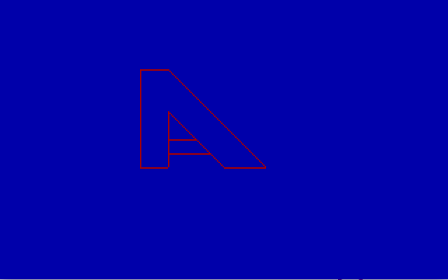

# Drawing in NASM

This is a solution for a task from Computer Graphics course at ITMO University.

The task is to draw "A" letter in the way shown by teacher on paper using assembly for VGA mode of DOS.

## Result

